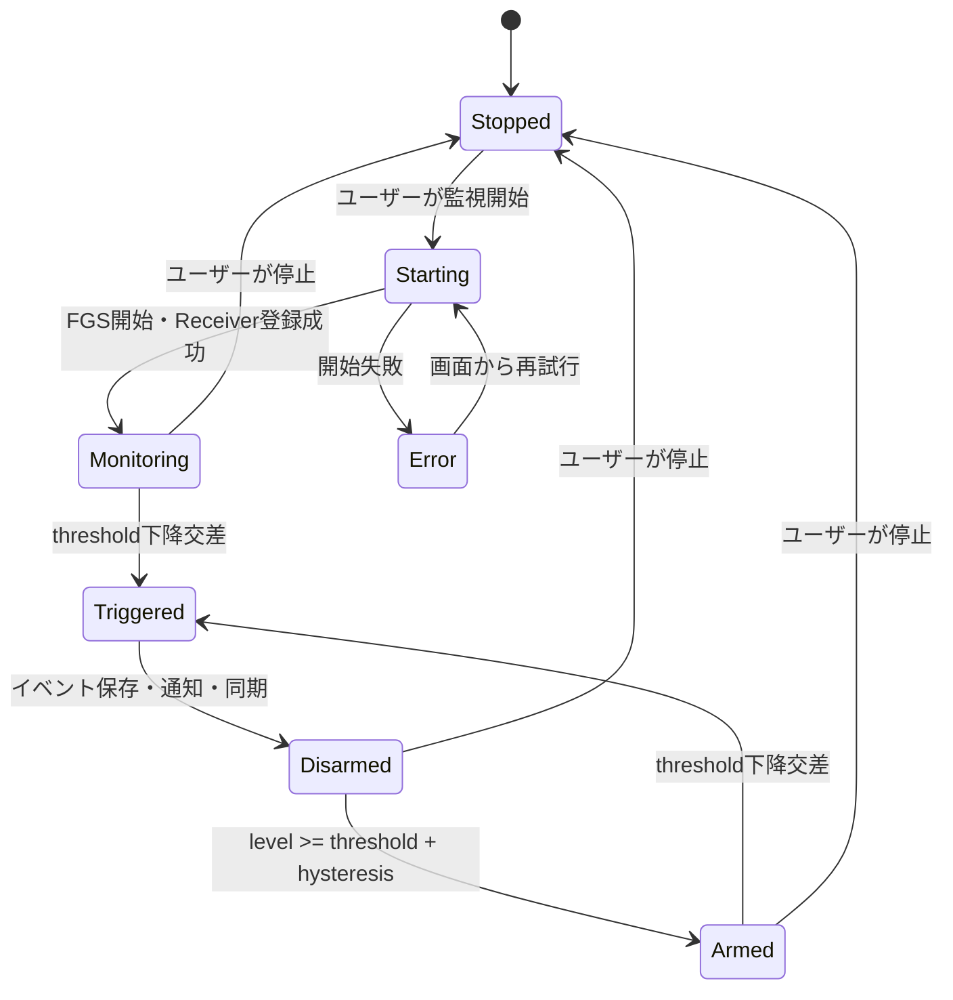

# 通知・バックグラウンド監視仕様書

文書ID: NBS-001  
版: 0.1  
状態: Draft  
最終更新: 2026-08-09

## 1. 監視方式

任意のユーザー設定しきい値を確実に判定するには、`ACTION_BATTERY_CHANGED`を実行時登録して継続的に受信する必要がある。このbroadcastはManifest Receiverでは受信できないため、v1.0はユーザーが明示的に開始するForeground Service（FGS）を監視の実行主体とする。

- Service type: `specialUse`。
- Manifest permissions: `FOREGROUND_SERVICE`、`FOREGROUND_SERVICE_SPECIAL_USE`。
- Manifest property: `android.app.PROPERTY_SPECIAL_USE_FGS_SUBTYPE`へ、ユーザー設定値でスマートフォン電池を監視しWearへ通知する中核機能であることを具体的に記載する。
- 実行中は停止アクション付きongoing通知を常に表示する。
- Google Play公開前にFGS申告と審査要件を人間が確認する。

FGSが承認されない配布形態では、WorkManagerによる周期確認へ機能を落とす代替案を別ADRで再決定する。周期処理では即時性を保証できないため、v1.0の既定仕様と混在させない。

## 2. 監視状態機械



実装上、初回Monitoringは`armed=true`または現在値に応じた初期状態を持つ。監視開始時にすでにしきい値以下の場合、v1.0は通知せず`Disarmed`として開始し、いったん`threshold + 2`以上になった後にアームする。

## 3. 電池入力

1. `registerReceiver(receiver, IntentFilter(Intent.ACTION_BATTERY_CHANGED))`でsticky intentを取得する。
2. `BatteryManager.EXTRA_LEVEL`と`EXTRA_SCALE`を検証する。
3. scaleが0以下、levelが負、必須項目欠落なら破棄する。
4. 百分率を0～100へ正規化する。
5. plugged/statusから充電状態を判定する。
6. 同じ残量・充電状態の重複inputは、鮮度更新が必要な周期を除き処理を省略する。

## 4. しきい値アルゴリズム

```text
if monitoring is off: no event
else if charging: update state; do not trigger
else if not armed:
    if level >= threshold + hysteresis: arm
else if (threshold < 100 and previousLevel > threshold and level <= threshold)
     or (threshold == 100 and previousLevel == 100 and level < 100):
    create one event and disarm
```

threshold=100は上側の値が存在しないため、満充電100%から99%以下へ離れる下降を交差と定義する。初回観測が100%なら通知せずarmed、99%以下なら通知せずDisarmedとする。設定変更だけでは通知せず、現在値が100%の場合だけ次の下降に備えてarmedとする。再アーム値は`min(100, threshold + hysteresis)`であり、threshold=100では100%である。

- 比較は整数百分率で行う。
- しきい値変更だけではイベントを作らない。
- 連続した同値、順不同callback、Service再生成に耐えるようAlertStateをDataStoreへ保存する。
- イベント作成、disarm、sequence増加、outbox記録を同じDataStore transactionで行う。

### 4.1 満充電アルゴリズム

- 既定値は`fullChargeNotificationEnabled=false`とし、監視中かつ有効な場合だけ評価する。
- 充電中の初回正常観測が100%未満なら、その充電セッションの満充電通知をarmする。初回が100%なら通知せずdisarmする。
- 同一充電セッションで`previousLevelPercent < 100 && currentLevelPercent == 100 && isCharging`となった最初の1回だけ`FullChargeReachedEvent`を生成する。
- 通知後に充電中のまま99%と100%を往復しても再armしない。非充電状態を1回観測し、その後100%未満で充電を開始した場合だけ次のセッションをarmする。
- 設定をONにした時点が充電中100%未満なら現在セッションをarmできるが、100%ならイベントを生成せず次の充電セッションまで待つ。OFFは満充電判定をdisarmする。
- イベント作成、disarm、sequence増加、Mobile通知outbox、Wear同期outboxを同じDataStore transactionで確定する。

## 5. Notification Channel

| Channel ID | 重要度 | 用途 | ユーザー制御 |
|---|---|---|---|
| `monitoring_status` | LOW | FGS実行中のongoing通知 | 音・振動なし、停止アクションあり |
| `battery_alerts` | HIGHを初期提案 | しきい値到達 | 音・振動はOS設定に従う |
| `sync_issues` | DEFAULTまたはLOW | 監視復旧が必要なとき | 頻発させない |

Channel作成後は重要度をアプリから変更できないため、文言と初期値をリリース前に実機確認する。

満充電通知も`battery_alerts`を使用する。通知種別ごとに安定したeventId由来IDを使い、低残量通知と満充電通知を同じIDで上書きしない。

## 6. Mobile通知

### しきい値通知

- タイトルに現在残量を含める。
- 本文に設定しきい値と充電を促す文言を含める。
- タップでM-003ホームを開く。
- eventId由来の安定したnotification IDを使う。
- Mobile通知は`setLocalOnly(true)`とし、Wear側の明示ローカル通知との二重表示を避ける。
- 機密情報ではないためロック画面表示はOS既定に従う。

### ongoing通知

- `Battery monitoring is on / 電池を監視中`と設定しきい値を表示する。
- `停止 / Stop`アクションは明示的BroadcastReceiverへ送る。
- Service停止後は速やかにongoing通知を除去する。
- 通知権限が拒否されてもFGS開始自体は可能だが、ユーザー可視性と機能価値を損なうため、開始前に権限を案内し、タスクマネージャ表示を含むOS挙動を試験する。

## 7. 再起動と復旧

- `RECEIVE_BOOT_COMPLETED`を宣言し、監視が有効だった場合だけ復旧を試みる。
- BootReceiverは短時間で終了し、重い処理をしない。
- 対象OS/FGS typeのboot開始制限をバージョン別にテストする。
- FGS開始が許可されない場合、監視中と偽らず`resumeRequired=true`を保存する。次に許可されたユーザー接点で再開案内を出す。
- アプリ強制停止後はOS仕様上broadcastが届かないため、ユーザーが再度アプリを開くまで監視できないことをヘルプに記載する。
- アプリ更新後は`MY_PACKAGE_REPLACED`から同じ復旧ポリシーを適用する。

## 8. バッテリー効率

- WakeLockを取得しない。
- 電池callbackごとにネットワーク処理や重いI/Oを行わない。
- Data Layer送信は状態変化時に限定し、短時間更新を集約する。
- ログの高頻度出力をreleaseで無効化する。
- FGS内に固定間隔polling loopを置かず、sticky broadcastとイベントを使用する。
- 人間がPixel 10 Pro Foldで24時間の監視ON/OFF比較を実施する。

## 9. 通知権限

- Android 13（API 33）以上では`POST_NOTIFICATIONS`を実行時要求する。
- 初回起動直後に無説明で要求せず、価値説明の後にユーザー操作で要求する。
- 拒否時はOSダイアログを繰り返さず、画面上の状態と設定導線を提供する。
- MobileとWearは別端末・別インストールのため、それぞれ権限状態を管理する。

## 10. 受け入れ条件

- AC-002、AC-003、AC-012を満たす。
- 監視中にActivityを閉じても、しきい値交差が通知される。
- 監視停止後は通知・同期イベントが生成されない。
- 再起動後の監視復旧結果を正しく表示し、復旧失敗を監視中と表示しない。
- 通知拒否、channel無効、アプリ強制停止の各状態を実機確認する。

## 11. 参考

- [ACTION_BATTERY_CHANGED](https://developer.android.com/reference/android/content/Intent#ACTION_BATTERY_CHANGED)
- [Foreground service types](https://developer.android.com/develop/background-work/services/fgs/service-types)
- [Foreground service start restrictions](https://developer.android.com/develop/background-work/services/fgs/restrictions-bg-start)
- [Notification runtime permission](https://developer.android.com/develop/ui/compose/notifications/notification-permission)
