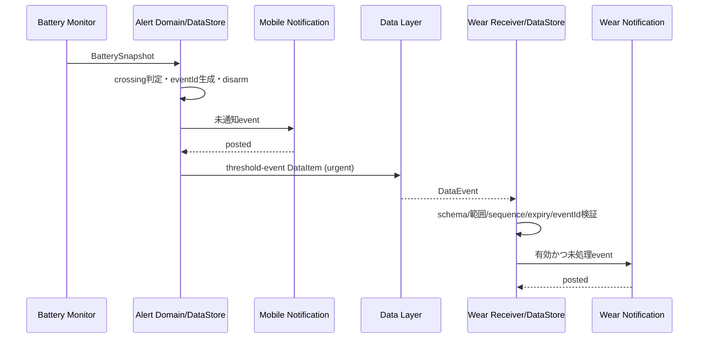

# 通知ブリッジ仕様書

文書ID: NBR-001  
版: 0.1  
状態: Draft  
最終更新: 2026-07-20

## 1. 目的

Mobileで確定したしきい値到達イベントをWearへ伝え、MobileとWearでそれぞれ1回だけ通知する。Android標準の通知ミラーリングへ全面依存せず、到達イベントをData Layerで明示的に連携する。

## 2. 責務

| コンポーネント | 責務 |
|---|---|
| Alert domain | eventId、有効期限、到達値を持つイベントを1回だけ生成 |
| Mobile notification adapter | Mobileローカル通知を冪等に投稿 |
| Notification bridge sender | event DataItemを送信し、outbox状態を更新 |
| Wear bridge receiver | 検証、有効期限、重複を判定 |
| Wear notification adapter | Wearローカル通知を投稿 |

## 3. 通知フロー

## 4. 重複防止

- Mobileは`lastMobileNotifiedEventId`、Wearは`lastProcessedEventId`をDataStoreへ保存する。
- notification IDはeventIdを安定hashして生成する。
- DataItem再配信、Service再生成、プロセス再起動で同じeventIdを受けても投稿しない。
- Wearは処理予約を原子的に保存してから通知する。投稿API失敗時の状態は`RESERVED_FAILED`として上限付き再試行可能にする。
- Mobileの通知には`setLocalOnly(true)`を設定し、WearへのOS自動ブリッジとWearローカル通知の重複を防ぐ。

## 5. 有効期限

- eventの既定有効期限は発生から5分。
- `receivedAt <= expiresAt`かつ端末時刻差が許容範囲なら通知する。
- 期限切れの場合は通知せず、eventIdを処理済みにして再受信を防ぐ。
- 端末時計が5分を超えてずれている疑いがある場合は通知せず、状態画面へ同期時刻警告を出す。
- 再接続後の状態表示は有効期限と無関係に最新state DataItemを採用する。

## 6. 権限別動作

| Mobile権限 | Wear権限 | 結果 |
|---|---|---|
| 許可 | 許可 | 両端末で各1件 |
| 拒否 | 許可 | Wearのみ。Mobile画面に権限案内 |
| 許可 | 拒否 | Mobileのみ。Wear画面に権限案内 |
| 拒否 | 拒否 | 通知なし。両端末の状態表示とイベント記録は更新 |

権限拒否を同期失敗と扱わない。ユーザー選択として状態へ反映する。

## 7. Wear未インストール・Data Layer不可

- Mobile通知は影響を受けず動作する。
- イベントは最新DataItemとして送信を試みるが、Mobileの監視を停止しない。
- OS自動ブリッジをfallbackにするかはv1.0では採用しない。`setLocalOnly(true)`を一貫して使い、挙動を決定的にする。
- Wearインストール後は現在stateを同期するが、期限切れ過去イベントは通知しない。

## 8. 通知内容

通知文言はイベント生成時の言語文字列を送らず、数値データだけを送り、各端末が現在のLocaleで組み立てる。これによりMobileとWearの言語設定が異なる場合も正しく表示される。

## 9. 受け入れ条件

- 1イベントにつきMobileとWearで最大1件。
- event DataItemを10回再送しても通知件数は増えない。
- 切断が5分を超えた後の再接続ではWear通知を出さない。
- Mobile/Wearの権限4組合せが表どおりになる。
- MobileとWearの言語を別々に設定し、それぞれのLocaleで通知される。

