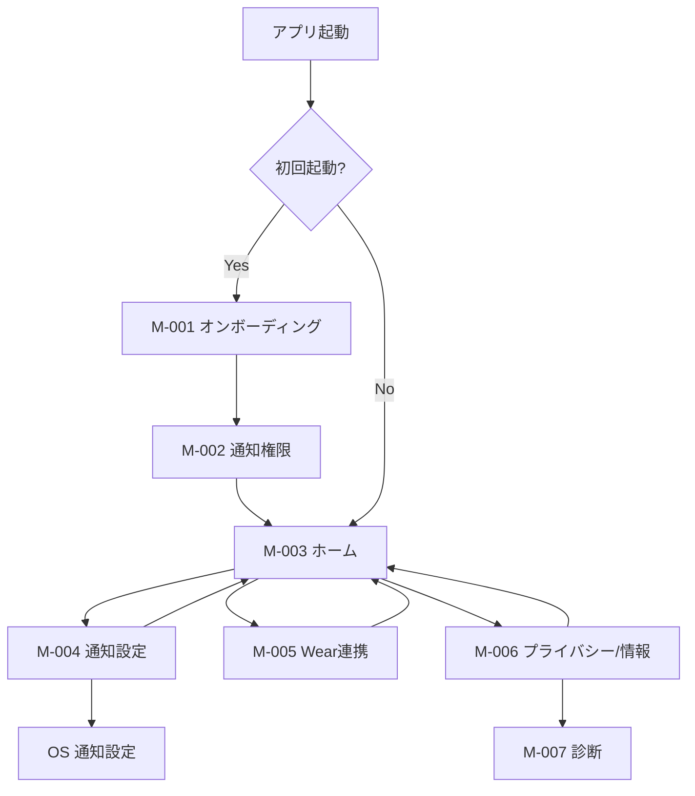
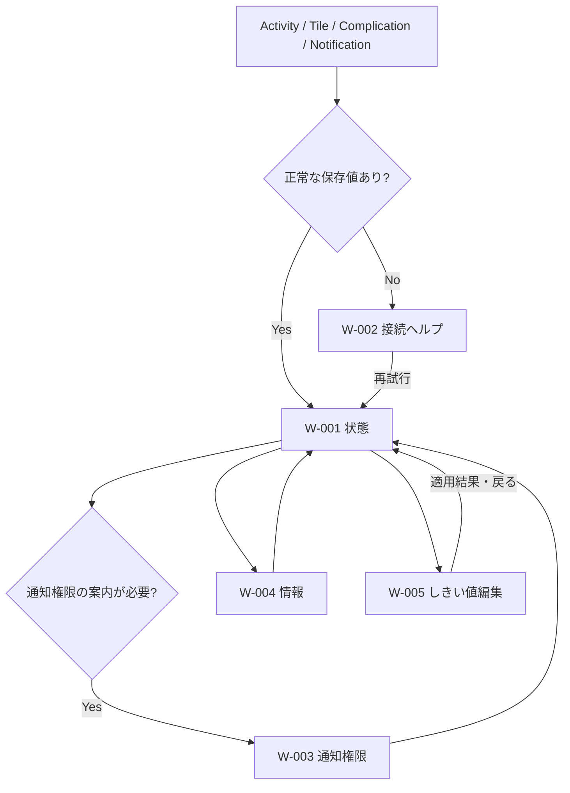

# 画面仕様書・画面遷移図

文書ID: UIS-001  
版: 0.1  
状態: Draft  
最終更新: 2026-07-29

## 1. Mobile画面一覧

| ID | 画面 | 主な内容 |
|---|---|---|
| M-001 | オンボーディング | 機能、継続監視、プライバシー説明 |
| M-002 | 通知権限 | 権限の目的、許可、後で設定 |
| M-003 | ホーム | 現在残量、しきい値、監視、Wear同期状態 |
| M-004 | 通知設定 | しきい値、監視開始/停止、通知設定導線 |
| M-005 | Wear連携 | node状態、最終同期、セットアップ、再同期 |
| M-006 | プライバシー/情報 | 収集データ、権限、バージョン、ライセンス |
| M-007 | 診断 | schema、sequence、最終送信、最終エラー。デバッグビルドまたは明示操作で表示 |

## 2. Mobile画面詳細

### M-001 オンボーディング

- タイトル、3点以内の機能説明、電池監視のためongoing通知が出る説明。
- `次へ / Continue`、`プライバシー / Privacy`。
- 完了状態はDataStoreへ保存する。

### M-002 通知権限

- OSダイアログ前に、Mobile/Wear通知と監視中通知の用途を説明する。
- `通知を許可 / Allow notifications`でOS権限要求を開始する。
- 拒否後は繰り返し自動表示せず、M-004からシステム設定へ移動できるようにする。

### M-003 ホーム

- 現在のMobile残量、充電状態、監視中/停止中。
- しきい値と次の通知がアーム済みか。
- Wearの到達可能状態、最終送信結果、最終同期時刻。
- 主操作: `設定`、`Wear連携`。監視停止時は`監視を開始`を強調する。

### M-004 通知設定

- 5～100%のスライダーと数値表示。アクセシビリティ用の増減ボタンを併設する。
- 保存は明示ボタン方式とし、連続ドラッグ中にData Layerへ大量送信しない。
- 監視ON/OFF。ONはユーザーのタップを起点にFGSを開始する。
- 現在値以下へしきい値を上げた場合の挙動を説明する。

### M-005 Wear連携

- ペアリングの断定ではなく、Data Layerの利用可否、到達可能node、最終正常送信を分けて表示する。
- `今すぐ同期 / Sync now`は現在値を再取得してurgent送信する。
- Wearアプリ未検出時はPlay Store/ウォッチ側インストールの案内を表示する。

### M-006 プライバシー/情報

- 端末内に保存する項目、端末間で送る項目、収集しない項目。
- 通知・FGS権限の説明とシステム設定への導線。
- アプリ版、schemaVersion、オープンソースライセンス。

## 3. Wear画面一覧

| ID | 画面 | 主な内容 |
|---|---|---|
| W-001 | 状態 | Mobile残量、充電状態、鮮度、しきい値 |
| W-002 | 接続ヘルプ | Mobile未検出、両アプリ確認、再試行 |
| W-003 | 通知権限 | Wear通知の説明と権限要求 |
| W-004 | 情報 | アプリ版、最終受信、schema、Mobileで設定する案内 |
| W-005 | しきい値編集 | Wear固有の非セグメント型スライダーによる5～100%・1%刻みの下書き、減少・増加操作、保存、送信中、未保存、競合、再試行 |

v1.0ではWear上のしきい値編集を行わない。BN-002のv1.1提案ではW-005からMobileへ変更を要求するが、設定の正本と永続化writerはMobileへ一本化する。

W-005のスライダーに併設する減少・増加操作はWearの永続下書きだけを更新する。連続操作中はData Layerへ送信せず、明示的な保存操作で最終下書き値だけを1回要求する。96個の値を扱うためセグメント表示は使用しない。リューズ回転はしきい値編集へ割り当てず、画面スクロールに使用する。

## 4. 画面遷移図

### Mobile

### Wear

### W-005 しきい値編集（BN-002提案）

- W-001の現在しきい値から遷移し、最後の正常なMobile値を初期下書きにする。
- 5～100%を1%単位で増減し、保存は明示ボタンで行う。
- 保存中は二重操作を無効化するが、画面を閉じても下書きと未確定`requestId`をWear Proto DataStoreへ保持する。
- Message送信成功だけを「保存済み」と表示しない。Mobile結果とphone-stateの収束を別状態で示す。
- 切断/送信失敗では未保存、結果喪失では結果不明、競合ではMobile有効値を示し、それぞれ復旧操作を併記する。
- No Dataまたは対応Mobile capabilityなしでは保存を無効にし、W-002へ案内する。

## 5. Fold対応

- 特定の物理向きや縦横固定に依存せず、現在のWindow Size Classでレイアウトを決める。
- Compactでは1カラム、Medium以上では状態カードと設定カードの2ペインを許可する。
- 折りたたみ・展開やマルチウィンドウでActivityが再生成されても、編集中のしきい値は`SavedStateHandle`で保持する。
- ヒンジ領域へ主要情報や操作を置かない。必要時はWindowManagerのdisplay feature情報を利用する。
- Pixel 10 Pro Foldの外側画面、内側画面、分割画面でスクロール不能・クリップ・ダイアログ位置ずれがないことを確認する。

## 6. 共通UIルール

- ComposeとMaterial 3を使用する。WearはWear Composeコンポーネントを優先する。
- 最小タップ領域、コントラスト、TalkBack、フォント拡大を確認する。
- エラーは復旧操作と組にし、内部例外文をそのまま表示しない。
- 相対時刻は日英の複数形を含めリソース化する。
- 画面文言の正本は[localization-specification.md](localization-specification.md)とする。
