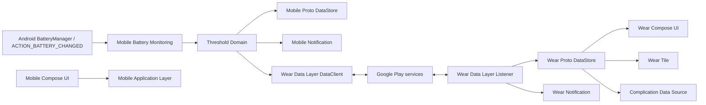

# システムアーキテクチャ設計書

文書ID: SAD-001  
版: 0.1  
状態: Draft  
最終更新: 2026-07-20

## 1. アーキテクチャ方針

小規模アプリに過剰な抽象化を持ち込まず、簡易DDDとAndroid推奨の単方向データフローを組み合わせる。

- ドメインルールをAndroid APIから分離し、JVM単体テスト可能にする。
- UI、アプリケーション、ドメイン、データ/プラットフォームの依存方向を内側へ向ける。
- 1ユースケース1クラスを機械的に増やさず、複雑な業務ルールだけを明示的なUseCaseへする。
- Repositoryは保存先やData Layerなど外部境界がある箇所に限定する。
- 初期版は手動DIを採用し、依存数やスコープが増えた時点でHilt導入を再評価する。

## 2. システム構成



Data Layerは配送路であり永続ストレージではない。各端末は受信した正常値を自身のDataStoreへ保存する。

## 3. 境界づけられたコンテキスト

| コンテキスト | 責務 | 主なモデル |
|---|---|---|
| Battery Monitoring | OS電池値の取得・正規化 | `BatterySnapshot` |
| Alerting | しきい値、再アーム、通知イベント | `AlertRule`, `AlertState`, `ThresholdReachedEvent` |
| Wear Synchronization | DTO検証、順序、送受信、再接続 | `BatterySyncEnvelope`, `SyncCursor` |
| Presentation | 画面状態、鮮度、ローカライズ | `BatteryUiState`, `Freshness` |

この規模では各コンテキストを独立Gradleモジュールにせず、パッケージ境界と依存テストで分離する。

## 4. レイヤ

### Presentation

- Compose UI、ViewModel、UI state。
- domain/dataの`Flow`を`StateFlow`へ変換する。
- Android API呼び出しやDataStore直接アクセスを行わない。

### Application

- `StartMonitoring`、`StopMonitoring`、`ChangeThreshold`、`ProcessBatterySnapshot`、`SyncCurrentState`などの処理調整。
- トランザクション境界、Repository呼び出し順、通知・同期副作用を管理する。

### Domain

- Kotlinのみで記述する値オブジェクト、エンティティ、ポリシー。
- しきい値交差、再アーム、鮮度、順序比較、データ検証を実装する。
- `Context`、`Intent`、Google Play services型へ依存しない。

### Data / Platform

- Proto DataStore、BatteryManager、BroadcastReceiver、Foreground Service。
- DataClient、WearableListenerService、NotificationManager。
- DTOとdomain modelのMapper。

## 5. Mobile推奨パッケージ

```text
BatteryNotifierAndroidMobileApp/app/src/main/java/<base-package>/
  presentation/
  application/
  domain/
    battery/
    alert/
    sync/
  data/
    datastore/
    wearable/
  platform/
    battery/
    notification/
    service/
    boot/
```

## 6. Wear推奨パッケージ

```text
BatteryNotifierAndroidWearApp/app/src/main/java/<base-package>/
  presentation/
  application/
  domain/
  data/
    datastore/
    wearable/
  platform/
    notification/
  tile/
  complication/
```

Mobile/Wearのapplication IDと署名は一致させる。現在の雛形は異なるapplication IDであるため、Data Layer実装前に同じ値へ変更する。Kotlin namespaceは必要に応じて端末別サブパッケージを使ってよい。

## 7. 状態フロー

1. Foreground Serviceが`ACTION_BATTERY_CHANGED`を受信する。
2. Adapterが`BatterySnapshot`へ正規化する。
3. Application層が現在の`AlertState`とともにdomainの判定器へ渡す。
4. 結果を1回のDataStore更新で保存する。
5. 状態変化があればMobile UIへFlowで反映する。
6. 到達イベントがあればMobile通知を冪等に投稿する。
7. 最新状態とイベントをData Layerへ送る。
8. Wearが検証・順序判定・保存し、UI/Tile/Complication/通知を更新する。

## 8. 並行処理

- 電池イベント処理は単一`CoroutineScope`と`Mutex`または単一actorで直列化する。
- DataStoreの`updateData`内で`sequence`増加と状態保存を原子的に行う。
- 通知と同期は保存済みのoutbox状態から実行し、成功後に配信済みフラグを更新する。
- 同期失敗は状態を失わず、次の電池更新、node変化、手動同期で再試行する。
- ViewModelは保存層のFlowを読むだけとし、複数の独立した真実のソースを作らない。

## 9. エラー処理

| エラー | 方針 |
|---|---|
| Battery intent項目欠落 | 入力を破棄し診断カウンタを加算 |
| DataStore破損 | serializerで破損を検知し、安全な既定値への回復とエラー記録 |
| Data Layer利用不可 | Mobile監視・通知は継続し、UIへ同期不可を表示 |
| 同期Task失敗 | 指数バックオフではなく次の自然な契機＋上限付き明示再試行 |
| 未対応schema | 直前正常値を保持し、アプリ更新案内 |
| 通知権限なし | 例外扱いせず、通知不可状態としてUIへ公開 |
| FGS開始制限 | ユーザー操作からの再開を案内し、バックグラウンドから無理に再試行しない |

## 10. ビルドと品質ゲート

- Android Studioで両プロジェクトを個別に開いてビルド可能にする。
- domain単体テスト、DataStore/Mapperテスト、Compose UIテスト、Data Layer統合テストを分ける。
- 両アプリの同期契約に同じfixtureを適用するcontract testを用意する。
- Pull Request相当の作業完了条件は、仕様更新、テスト、レビュー、`state.yaml`更新である。

詳細決定は[architecture-decision-records.md](architecture-decision-records.md)を参照する。

