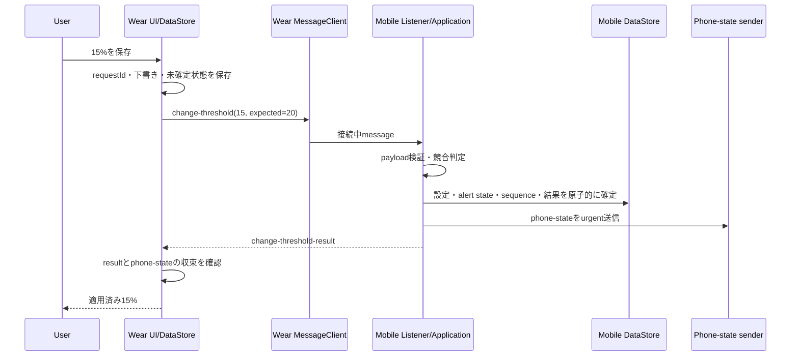

# Wear OS連携仕様書

文書ID: WIS-001  
版: 0.1  
状態: Draft  
最終更新: 2026-08-09

## 1. 目的

Mobileの電池状態と到達イベントをWearへ安全かつ省電力に同期し、切断・再接続・再起動・連続更新後も最新状態へ収束させる。

## 2. 前提条件

- Wearable Data Layer APIを使用する。
- MobileとWearのapplication IDおよび署名証明書を一致させる。
- Google Play servicesのAPI利用可否を実行時に確認する。
- 対象はAndroid phoneとWear OSの組合せであり、iOSペアリングは対象外とする。
- Data Layerを永続ストレージにせず、両端末のDataStoreを真実のソースとする。

## 3. API選択

| API | 用途 | 理由 |
|---|---|---|
| DataClient / DataItem | 最新状態と到達イベント | 切断中にバッファされ、再接続時に同期できる |
| MessageClient | Wearからの即時状態要求 | 保存不要のベストエフォート要求に適する |
| MessageClient | Wearからのしきい値変更要求とMobileの結果応答 | 接続中RPCとして扱い、遅延した自動適用を避ける |
| MessageClient | Wearからの満充電通知設定要求 | Mobile単一writerを維持し、切断中の遅延自動適用を避ける |
| NodeClient | 現在到達可能なnodeの診断 | UIの接続参考情報に使う |
| CapabilityClient | 対応アプリ/nodeの発見 | Mobile/Wear機能の存在確認に使う |

## 4. 送信契機

- 監視開始・停止。
- 残量または充電状態の変更。
- しきい値変更。
- 満充電通知設定変更と満充電イベント生成。
- 到達イベント生成。
- nodeの再到達。
- Wearからの状態要求。
- Mobile再起動後の復旧。
- ユーザーの「今すぐ同期」。

表示遅延が利用体験へ直結するため、状態変化とイベントは`setUrgent()`を使用する。ただし同じBatterySnapshotを短時間に連続送信しないよう250～500msの集約窓を設ける。

## 5. 接続状態別動作

### 接続中

1. MobileはDataStoreへ状態を確定する。
2. 固定パスのstate DataItemを更新する。
3. 到達時はevent DataItemも更新する。
4. WearはListener Serviceで受信し、検証後に保存する。
5. UI、Tile、コンプリケーションを更新し、有効イベントなら通知する。

### 切断中

- Mobile監視とMobile通知を継続する。
- DataItemへ最新状態を書き続ける。固定パスのため最終値へ収束する。
- Wearは保存済み値を表示し、5分超でStaleとする。
- 到達イベントは5分で期限切れとし、遅れて届いた警告でユーザーを混乱させない。

### 再接続

1. node/capability変化または送信成功で再接続を検知する。
2. Mobileは古いキャッシュを再送するのではなく、現在の電池値を再取得する。
3. sequenceを増やし、stateをurgent送信する。
4. Wearはsequence比較で最新だけを採用する。
5. eventが期限内なら通知し、期限切れなら処理済みにして通知しない。

## 6. Wear受信サービス

- `WearableListenerService`でアプリ非表示時もDataItemイベントを処理する。
- Manifestのpath prefix/filterを`/battery-notifier/v1/`へ限定する。
- `onDataChanged`内で長時間処理せず、検証・DataStore保存・通知更新を構造化Coroutineへ移す。
- Activityの`onResume` listenerだけに依存しない。
- サービスの重複呼び出しに備えてeventIdとsequenceで冪等にする。

## 7. ライフサイクル

| 状況 | 動作 |
|---|---|
| Mobile Activity停止 | FGSが監視を継続。UI listenerは解除 |
| Mobile process再生成 | DataStoreから状態復元後、現在値で再評価 |
| Wear Activity停止 | Listener Serviceは受信可能。UIタイマーは停止 |
| Wear process再生成 | DataStoreを読み、Freshnessを再計算 |
| Google Play services更新 | clientを保持し続けず、必要時に再生成 |
| アプリ更新 | schemaVersionを維持し、後方互換Readerを最低1版保持 |

## 8. 連続更新と競合

- Mobile側イベント処理を直列化する。
- DataItem送信結果の返却順は状態順序を保証しないため、Wearは必ずpayload sequenceで判断する。
- 送信AのTaskが送信Bより後に完了しても、DataStoreの`lastSyncedSequence`は最大値だけを保存する。
- 同じ値の再送にも新しいsequenceを含め、DataItem変更として認識させる。
- Watchでは通知処理済み記録を通知投稿前に原子的に予約し、並行callbackによる二重投稿を防ぐ。投稿失敗時は再試行可能な状態を明示する。

## 9. セキュリティ

- Data Layerの同一package/署名検証を利用する。
- 端末識別子、アカウント、位置、ネットワーク情報をpayloadへ含めない。
- 受信値を信頼せず[data-design.md](data-design.md)の順序で検証する。
- 低レベルsocketや独自Bluetooth通信を実装しない。

## 10. 診断項目

- Data Layer API利用可否。
- 到達可能node数と表示名。ただし永続ログへ端末名を保存しない。
- 最終送信sequence/時刻/結果分類。
- 最終受信sequence/時刻。
- invalid payload、unsupported schema、duplicate、out-of-orderの件数。

## 11. 受け入れ条件

- AC-004～AC-008を満たす。
- Bluetooth直結、Wi-Fi利用、機内モードによる切断、再接続で結果を確認する。
- 30回の連続更新後、Wear値が最大sequenceの値と一致する。

## 12. 参考

- [Wear OS Data Layer overview](https://developer.android.com/training/wearables/data/overview)
- [Sync data items](https://developer.android.com/training/wearables/data/data-items)
- [Handle Data Layer events](https://developer.android.com/training/wearables/data/events)

## 13. Wearからのしきい値変更（BN-002提案）

設定の唯一の正本とProto DataStore writerはMobileに維持する。Wearは`ChangeThreshold`を直接実行せず、Mobileへ要求して結果とphone-stateを確認する。

### 接続中

- Wearは対応Mobile capabilityと到達可能nodeを確認し、要求元nodeを識別できるMessageClientで送る。
- Mobileの`WearableListenerService`は要求pathを完全一致で受信し、Android型をdomainへ渡さず型付き値へ変換する。
- Mobileは設定変更を電池callback、Mobile UIの設定変更、監視操作と同じ直列化境界へ入れる。
- Mobileは要求元nodeへ結果を返し、確定済みphone-stateもurgent送信する。
- MessageClientの送信成功だけではMobile適用成功とみなさない。Wearは結果受信まで未確定とする。

### 切断中・送信失敗

- Wearは編集下書きと`requestId`をProto DataStoreに保持する。
- 「接続を確認できないため保存していません」と表示し、有効なしきい値表示は最後のphone-state値から変えない。
- DataItemへcommandを置かず、再接続だけで古い要求を自動適用しない。
- node到達を確認できた後、ユーザーの明示的な「再試行」で同じ`requestId`を送る。

### 結果喪失・再接続

- Mobileで適用後に結果messageだけが失われても、要求結果はMobile Proto DataStoreに残る。
- Wearが同じ`requestId`を再試行すると、Mobileは設定変更とstate sequence増加を繰り返さず保存済み結果を返す。
- Wearが別nodeへ自動broadcastしない。要求時に選択した対応Mobile nodeが不明な場合は送信せず、接続案内を表示する。

### 競合

- Wear要求は最後に受信した有効なしきい値を`expectedThresholdPercent`として含める。
- Mobileの現在値が期待値と異なり、要求値とも異なる場合は`CONFLICT`を返し、Mobile設定を変更しない。
- Wearは結果の有効値を表示し、ユーザーが新しい`requestId`で編集し直せるようにする。

### Stale・No Data・再起動

- Staleは編集を禁止しないが、古い値を基準にした要求が競合し得ることを表示する。
- No Dataまたは互換Mobile capabilityなしでは保存操作を無効にする。
- Wear再起動は未確定要求を復元するだけで自動送信しない。
- Mobile再起動は保存済み直近結果を復元し、同じ`requestId`へ冪等に応答する。

### 互換性

- 旧Mobileは変更要求capabilityを公開しないため、新Wearは編集保存を無効にする。
- 新Mobileと旧Wearは既存のphone-state同期を継続する。
- 未対応schemaは設定を変更せず診断へ記録する。安全に`requestId`を読めないpayloadへ結果を捏造しない。

公式Android資料の確認日: 2026-07-29。MessageClientはRPC/remote-control用途で、接続が必要かつ永続化・自動再試行を持たない。DataItemは切断時にbufferされるため、本機能では遅延した設定適用を避ける目的でcommandに使用しない。

## 14. Wearからの満充電通知設定（BN-004）

- 設定の正本、Proto DataStore writer、充電セッション判定はMobileに置く。Wearは`enabled`と最後に確認した`expectedEnabled`を含む要求を送る。
- 接続中は`battery_notifier_full_charge_setting_writer_v1` capabilityを持つ単一Mobile nodeへ`/battery-notifier/v1/change-full-charge-setting`を送信し、Mobileは完全検証、期待値競合、冪等性を評価する。既存のしきい値writer capabilityでは代用しない。
- Mobileは設定、満充電arm状態、phone-state sequence、同期outboxを同じ直列化/transaction境界で確定し、Wearへphone-stateを送る。
- WearはMessage送信成功を適用成功とみなさず、後続phone-stateへ収束した時点で確定表示する。
- 切断、送信失敗、Wear/Mobile再起動では自動送信しない。再接続後もユーザーの明示的な再操作を待つ。
- 競合時はMobile設定を変更せず現在のphone-stateを再送する。No Data、旧Mobile、対応Capabilityなしでは切替を確定せず更新案内を表示する。
- phone-stateの`fullChargeNotificationEnabled`欠落は旧Mobileとしてfalse表示とし、編集を無効にする。満充電イベントは別の固定DataItem pathを使用し、旧Wearは未知pathとして無視する。
